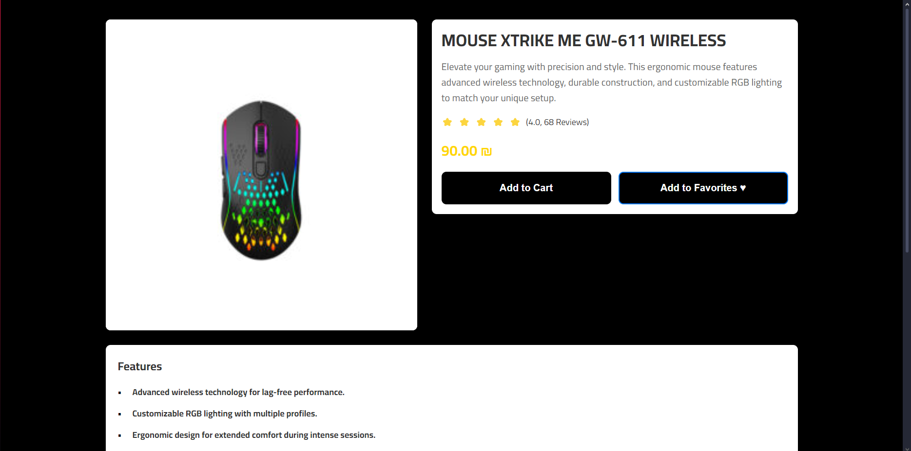
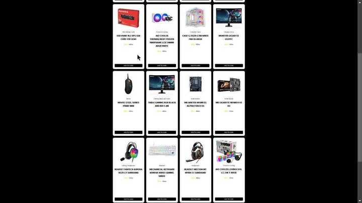
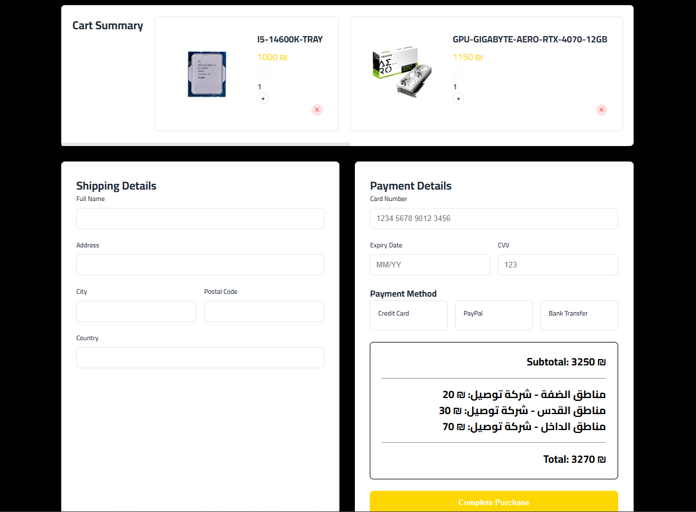

# MTC Platform for PCs and Tech

## Project Overview

This project is an e-commerce platform specializing in PCs and technology-related products. It provides a streamlined and user-friendly interface for browsing, filtering, and purchasing tech products. The platform incorporates modern web design principles and features to enhance user experience and engagement.

For more details and updates, visit our Facebook page: [MTC Electronics and Computers](https://www.facebook.com/mtcelectronicsandcomputers).

## Sitemap

- **Home Page:** Main page showcasing featured products, promotions, and navigation to main categories.
- **Products:**
  - **Categories:** Includes Telephones, Computers, Accessories, etc.
  - **Product Listing Pages:** Listings for each category with filtering and sorting options.
  - **Product Details Page:** Displays product images, descriptions, pricing, reviews, and an "Add to Cart" button.
  - **Search Results:** Displays results for user searches with filtering options.
- **Account:**
  - **Sign In / Register:** For returning and new customers.
  - **Profile:** User information, saved addresses, and payment methods.
  - **Order History:** List of past orders with details and tracking information.
  - **Wishlist:** Saved products for easy future access.
- **Cart:**
  - **Shopping Cart Overview:** Displays items, quantities, pricing, and a "Proceed to Checkout" option.
- **Checkout:**
  - **Shipping Information:** Collection of delivery details.
  - **Payment Options:** Secure entry for payment methods.
  - **Order Review:** Summary of order before final confirmation.
- **About Us:** Information about the store.
- **Customer Service:**
  - **Contact Us:** Form and contact information.
  - **Shipping & Returns:** Information on policies.
  - **Support:** Access to customer support.
- **Legal:**
  - **Privacy Policy**
  - **Terms & Conditions**
- **Footer:** Quick Links to main pages, Social Media links, Newsletter Signup form.

## Features

- **Product Categories:** Organized sections for easy navigation.
- **Dynamic Filtering:** Advanced filters to refine product search.
- **User Authentication:** Secure sign-up and login functionality.
- **Special Offers:** Highlighted deals to attract users.
- **Responsive Design:** Optimized for both desktop and mobile devices.
- **Order Survey Form:** Collects user input to personalize the shopping experience.

## Running the Project

1. Clone the repository:
   
bash
   git clone https://github.com/Web1-Teams/930am-grp8-repo.git

2. Navigate to the project directory:
   
bash
   cd 930am-grp8-repo

3. Install dependencies (if applicable):
   
bash
   npm install

4. Start the development server:
   
bash
   npm start

5. Open your browser and visit:
   
http://localhost:3000

## screenshots ##

## Trello Board

The Trello board for task management and project tracking is available [here](https://trello.com/invite/b/6756055f998ebfedb6638837/ATTI6821ba73cf456b196e7b84f82a0c98827C1CBC87/web-prog).

---

For further assistance, please refer to the repository documentation or contact the development team.

